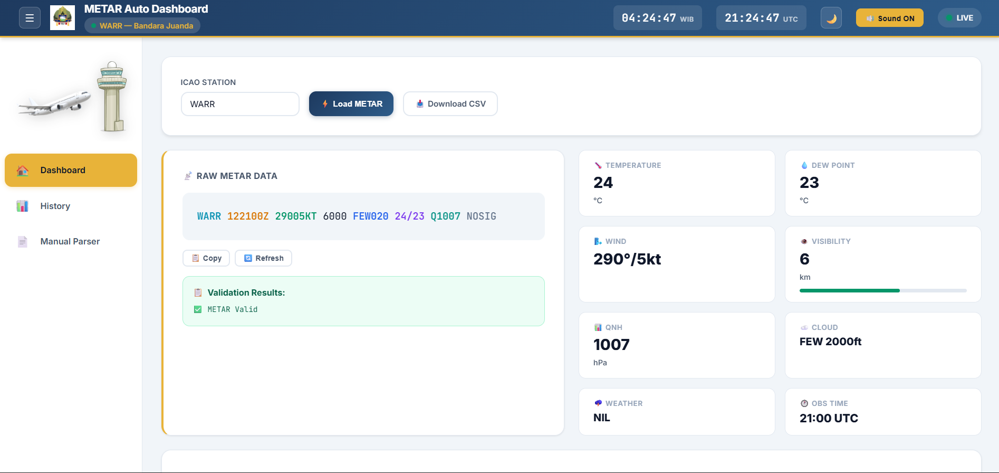
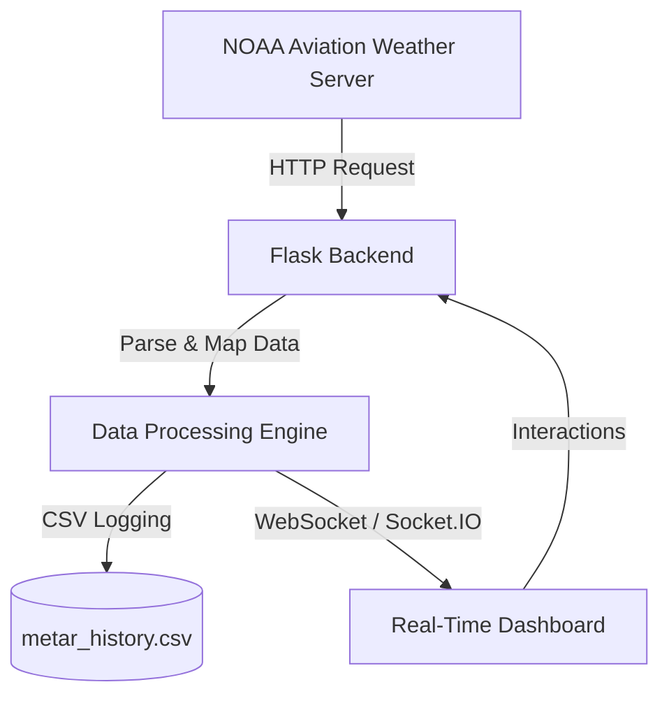

# 🌦️ METAR Auto Dashboard
### Aviation Weather Monitoring – BMKG Style

[](https://www.python.org/)
[](https://flask.palletsprojects.com/)
[](https://socket.io/)
[](LICENSE)

**METAR Auto Dashboard** adalah platform monitoring cuaca penerbangan real-time yang mengambil data langsung dari **NOAA Aviation Weather Server** dan menyajikannya dalam antarmuka operasional standar BMKG.

Sistem ini dirancang khusus untuk membantu pengamatan kondisi cuaca bandara secara otomatis dengan fitur visualisasi data, sistem peringatan dini (alert), analisis komponen angin runway, serta deteksi fenomena cuaca ekstrem secara instan.

---

## 📸 Dashboard Preview


*Antarmuka modern dengan visualisasi parameter cuaca lengkap, grafik tren, dan radar thunderstorm.*

---

## ✈️ Features

*   📡 **Real-Time METAR Monitoring**: Pengambilan data METAR otomatis dari server NOAA setiap interval tertentu (80 detik).
*   📊 **Weather Data Visualization**: Grafik interaktif untuk **Temperature**, **Pressure (QNH)**, dan **Wind Speed** menggunakan **Chart.js**.
*   🔔 **Advanced Alert System**:
    *   🔴 **Low Visibility**: Alarm otomatis jika jarak pandang di bawah 3000m.
    *   🌩️ **Thunderstorm Detected**: Peringatan visual pada modul radar jika terdeteksi fenomena badai guntur.
    *   ✈️ **Runway Crosswind**: Alert otomatis jika komponen angin melebihi batas operasional pesawat.
    *   🟢 **New Data Notification**: Notifikasi suara setiap ada pembaruan data dari server.
*   ✈️ **Runway Crosswind Analysis**: Kalkulator otomatis untuk komponen crosswind, headwind, dan tailwind terhadap arah runway (RWY 10/28).
*   🌩 **Thunderstorm Detection**: Algoritma cerdas yang memilah kode cuaca ekstrem (`TS`, `TSRA`, `VCTS`) langsung dari raw METAR.
*   📄 **Automatic QAM Generator**: Mengonversi paket data METAR menjadi format laporan berita cuaca (QAM) yang siap didistribusikan.
*   📥 **Data Management**:
    *   Penyimpanan history otomatis ke dalam format **CSV**.
    *   Ekspor history data berdasarkan rentang tanggal tertentu.
*   🔄 **Dynamic Refresh (No-Reload)**: Menggunakan **WebSocket (Socket.IO)** memastikan data dan grafik diperbarui secara instan tanpa perlu memuat ulang halaman.

---

## 🧠 System Architecture



---

## 📦 Tech Stack

| Layer | Technologies |
| :--- | :--- |
| **Backend** | Python 3.10+, Flask |
| **Real-time** | Flask-Socketio (EngineIO) |
| **Data Processing** | Pandas (CSV Handler), Re (Robust Regex Parser) |
| **Frontend** | Semantic HTML5, CSS3 Custom UI (Glassmorphism), JavaScript ES6+ |
| **Visualization** | Chart.js, Plotly.js (Wind Rose/Compass) |

---

## 🚀 Installation Guide

### 1. Clone Repository
```bash
git clone https://github.com/USERNAME/metar-auto-dashboard.git
cd metar-auto-dashboard
```

### 2. Create & Activate Virtual Environment
```bash
python -m venv .venv
# Windows:
.venv\Scripts\activate
# Mac / Linux:
source .venv/bin/activate
```

### 3. Install Dependencies
Pastikan file `requirements.txt` berisi dependensi berikut:
```text
flask
flask-socketio
pandas
requests
eventlet
```
Kemudian jalankan instalasi:
```bash
pip install -r requirements.txt
```

### 4. Run Application
```bash
python app.py
```
> [!IMPORTANT]
> **Penting**: Jalankan aplikasi menggunakan `python app.py`. Jangan menggunakan `flask run` karena fitur background loop dan WebSocket tidak akan berjalan optimal pada dev-server bawaan Flask.

Akses dashboard melalui browser: [http://127.0.0.1:5000](http://127.0.0.1:5000)

---

## 📂 Project Structure

```text
metar-auto-dashboard/
├── app.py                 # Inti aplikasi & Background fetcher
├── metar_history.csv      # Penyimpanan history data lokal
├── requirements.txt       # Daftar dependensi library
├── templates/             # UI Components (Jinja2)
│   ├── index.html         # Dashboard operasional utama
│   ├── history_by_date.html # Pencarian history data
│   └── manual_parser.html   # Alat bantu manual parser
├── static/                # Assets & Style
│   ├── style.css          # BMKG Aviation Design System v2
│   ├── dashboard.js       # Logika WebSocket & Visualisasi
│   ├── alarm.mp3          # Audio alert visibilitas rendah
│   └── notify.mp3         # Audio update data masuk
└── README.md
```

---

## 🔔 Alert Conditions

| Condition | Visual State | Action Trigger |
| :--- | :--- | :--- |
| **Visibility < 3000m** | 🔴 RED Alert | Alarm Sound + Banner |
| **Thunderstorm (TS)** | ⛈️ Danger | Alarm Sound + Radar Module Active |
| **New METAR Received** | 🟢 Normal | Professional Notification Sound |
| **Crosswind > 15kt** | ⚠️ Warning | Runway Status Indicator |

---

## 📡 Data Source & Config

Data METAR ditarik secara global dari:
**NOAA – National Oceanic and Atmospheric Administration**
*Station Default: WARR (Bandara Internasional Juanda, Surabaya)*

Interval pembaruan diatur secara default setiap **80 detik** dalam fungsi `background_metar_loop` di `app.py`.

---

## 🚀 Future Development

- [ ] Support Multi-station (Toggle stations/ICAO codes)
- [ ] Integration with Runway Surface Condition (RCC)
- [ ] Weather Risk AI Prediction using LSTM
- [ ] WhatsApp/Telegram Bot for instant weather alerts
- [ ] Wind Rose analysis for monthly period

---

## 📄 License

This project is licensed under the **MIT License**.

---
*Designed with ❤️ for BMKG Aviation Weather Monitoring.*
